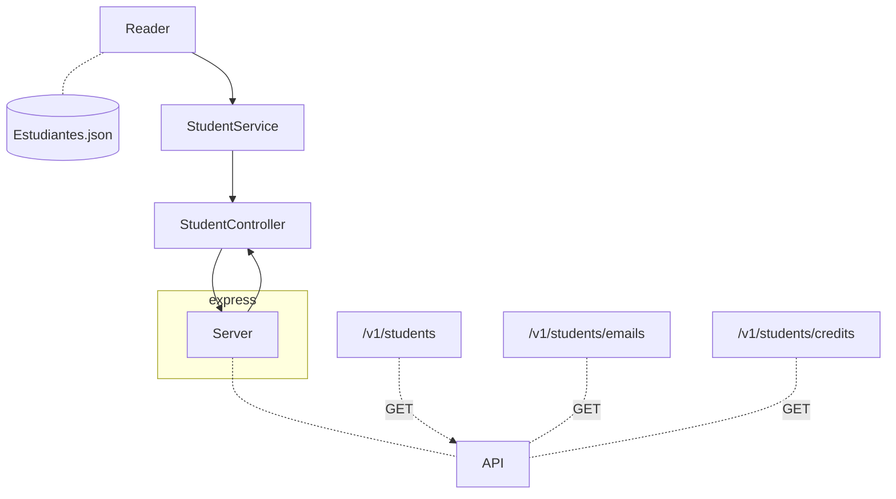
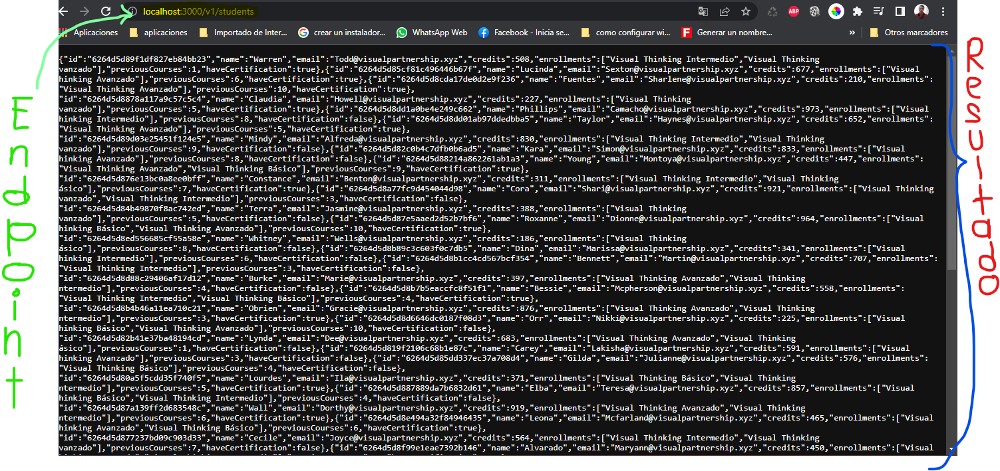
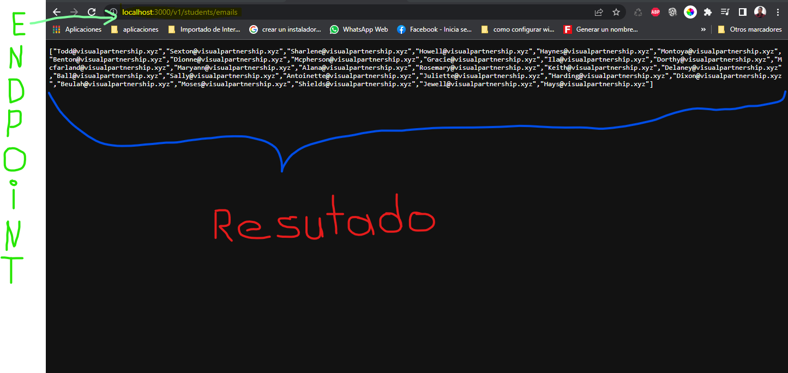
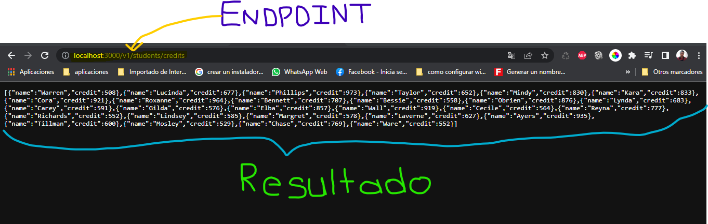

# Code Challenge - Esponer cierta información de los estudiantes.

## Dependencias que se utilizarón.
1. Dependeica Jest
    Es una dependencia que nos ayuda escribir y ejecutar los test unitarios dentro de nuestro proyecto.
    * Instalación de la dependencia:
      ```
      npm instal --save-dev jest
      ```
    * Configuración en package.json, se agrega el siguiente script para correr el test unitario:
      ```
      "test": "node ./node_modules/jest/bin/jest.js"
      ```
    * Escriba  en su terminal lo siguiente para ejecutar el test unitario:
      ```
      npm test "Aquí se escribe la ruta del archivo que se va probar el test"
      ```
      por ejemplo el del proyecto para el archivo Reader.test.js:
      ```
      npm test test/reader/Reader.test.js
      ```
2. Dependecia express
    Es una framwork que nor permite crear server y a exponer información con método HTPP (GET, POST, PUT, DELETE).
    * Método HTPP:
        - GET: Lo que hace es regresar informacón
        - POST: Lo que hace es persistir información
        - PUT: lo que hace es Actualizar la informacón
        - DELETE: lo que hace es Eliminar cierta información
    * Instalación de la dependecia:
        ```
        npm install express --save
        ```
    * Agregando en el package.json el siguiente script para poder correr el server:
        ```
        "server": "node ./Aquí va la ruta de nuestro server/Aqí va el nombre de nuestro server con su extención"
        ```
    * Ejemplo con el server del proyecto:
        ```
        "server": "node ./lib/server.js"
        ```
    * Como ejecutar el server:
        ```
        npm run server
        ```
3. Dependencia ESlinter
    Eslinter nos ayuda terner mas legible el código y a corregir la sintaxis de nuestro codigó en javaScript.
    *   nstalación:
         ```
        npm install eslint --save-dev
        ```
    *   Ejecuta el comando para generar la configuración del linter:
         ```
        npm init @eslint/config
        ```
        en la consola se mostrar las isguientes preguntas:
        * primera pregunta: `How would you like to use ESlinter?`, selecciones la opción `To check syntax and find problems`
         * segunda pregunta: `What type of modules does your project use?`, seleccione la opción `CommonJS (require/exports)`
        * tercer pregunta: `Which framework does your project use?`, seleccione la opción `None of these`
        * cuarta pregunta: `Does your project use Tyscript?`, seleccione la opción `No`
        * quinta pregunta: `Where does your code run?`, seleccione la opción `Browser`
        * sexta pregunta: `What format do you want your config files to be in?`, seleccione la opción `Javascript`
    *   Una ves instalado se crea un archivo `.eslintrc.js` y dentro vamos a agregar lo siguiente que son los roles.
        ```
        module.exports = {
            "env": {
                "browser": true,
                "commonjs": true,
                "es2021": true,
                "jest": true
            },
            "extends": "eslint:recommended",
            "parserOptions": {
                "ecmaVersion": "latest"
            },
            "rules": {
                indent: ["error", 4],
                "linebreak-style": ["error", "unix"],
                quotes: ["error", "double"],
                semi: ["error", "always"]
            }
        };
        ```
    *   Se agrega en el package.json el script:
         ```
        "linter": "node ./node_modules/eslint/bin/eslint.js .",
        "linter-fix": "node ./node_modules/eslint/bin/eslint.js . --fix"
        ```
    *   Ejecutamos linter para que nos diga cuales son las insconsistencia de nuestro codigo:
         ```
         npm run linter
        ```
    *   Ejecutamos linter para que nos diga cuales son las insconsistencia de nuestro codigo:
         ```
         npm run linter-fix
        ```

## Explicación del diseño de los componentes del proyecto.

## Cómo consultarla la API, para exponer sus funcionalidades.

### Tabla de la API

| Endpoint | Request | Response
| ----- | ----- | ----- |
| /v1/students | /v1/students | Consultar todos los estudiantes con todos sus campos. |
| /v1/students/emails | /v1/students/emails | Consultar los `emails` de todos los estudiantes que tengan certificación `haveCertification`. |
| /v1/students/credits | /v1/students/credits | Consultar todos los estudiantes que tengan `credits` mayor a `500 `. |

### Como consultar el endpoint desde un navegador:
El Método que se utiliza GET que solo expone la información de los estudiantes en un formato JSON (Estudiantes.json).
1.  Endpoint para consultar todos los estudiantes con todos sus campos:
    ```
    localhost:300/v1/students
    ```
    Asi es como mustra:
    
2. Endpoint para consultar los emails de todos los estudiantes que tengan certificación `haveCertification`.
    ```
    localhost:300/v1/students/emails
    ```
    Asi es como mustra:
    
3. Endpoint para consultar todos los estudiantes que tengan credits mayor a 500.
    ```
    localhost:300/v1/students/credits
    ```
    Asi es como mustra:
    